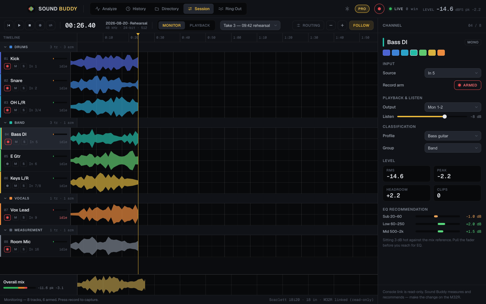
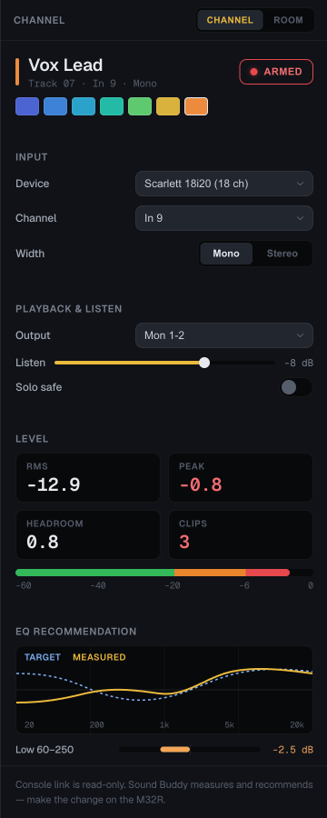
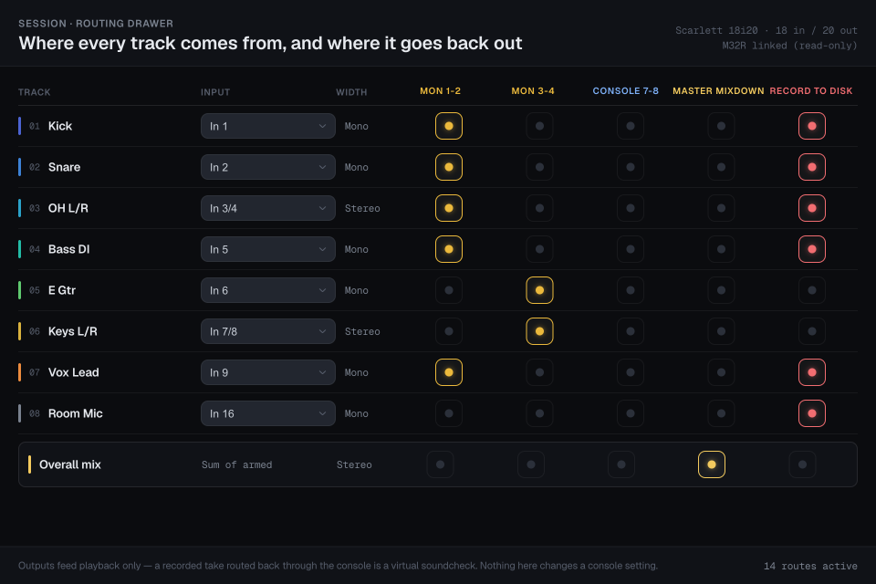
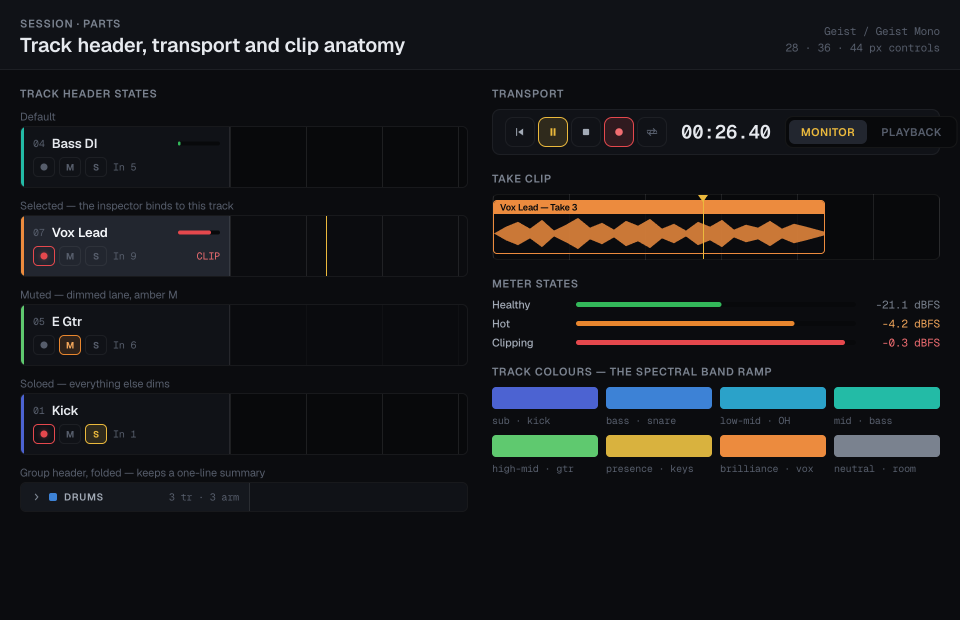

# Session tab — arrangement view layout spec

Reference for epic #990. Screenshots live in [`docs/screenshots/990/`](../screenshots/990/);
this file is the part that survives being read by something without eyes.

Governed by [ADR-0080](../adr/0080-the-daw-tab-merges-live-and-soundcheck-an-in-tab-transport-drives-the-timeline-supersedes-adr-0014.md).
Where this spec and the ADR disagree, the ADR wins.

## Read this first: the mockup's time scale is wrong for the app

The design mockup lays lanes out at **7.6 px/sec** (a 912px lane showing 120s). That number
is an artefact of the artboard width and **must not be copied**. The app's scale is
`PLAYHEAD_PX_PER_SECOND = 8` in `daw-shell-runtime.ts`, which the waveform painters and the
playhead already share. Use 8. Every gridline and tick spacing below is given in seconds for
that reason — multiply by the constant, never by a pixel figure lifted from the mockup.

The same applies to the waveforms: the mockup draws SVG polygons because a static artboard
has no peak stream. The app paints canvas via `drawDawWaveformLane`. Do not port the SVG.

## Vertical structure

Top to bottom inside `#tab-live`, all heights fixed except the track area:

| Band | Height | Notes |
|---|---|---|
| App header | `--header-h` (52px) | Existing app chrome, unchanged. `padding-left: var(--titlebar-safe-left)` clears the macOS traffic lights. |
| Transport toolbar | 44px | Transport cluster, clock, session/take picker, MONITOR/PLAYBACK, routing toggle, zoom, follow. |
| Ruler row | 26px | Gutter + tick strip. Bottom border `--border-default`. |
| Track area | flex, scrolls | Group header rows + track rows. Surplus space paints `--surface-inset`. |
| Master row | 60px | Top border `--border-strong`. |
| Status line | 26px | Track/capture summary left, device right. |

Row heights inside the track area:

| Row | Comfortable | Compact |
|---|---|---|
| Track row | 64px | 44px |
| Group header row | 28px | 28px |

## Horizontal structure

Two columns, one shared origin:

- **Track head column — 208px**, fixed. Emit once as `--daw-head-w` on `.daw-shell`.
  The ruler gutter, every track head and the master head all read it, and the playhead
  offsets from the same constant. This is the whole point of the story: one origin, so the
  ruler and the lanes cannot disagree about where t=0 is.
- **Lane column** — the remaining width.
- **Channel inspector — 320px**, docked right, its own border-left `--border-default`.
  (The standalone inspector artboard is drawn at 360px for legibility; 320px is the docked width.)

### Track head anatomy, left to right

1. Colour strip, 3px, full row height — the track's identity colour.
2. Selection strip, 2px, `--gold-500`, present only when selected.
3. Body, `padding: 0 9px`, two rows with 7px gap:
   - Row 1: index (`--fs-micro`, mono, `--text-muted`) · name (`--fs-body-sm`, 600, `--text-primary`) · inline level meter (42×4px)
   - Row 2: arm · M · S (each 20×18px, `--radius-xs`+1) · input label (mono, `--fs-micro`) · per-tick meta, right-aligned

### Lane anatomy

- Background `--surface-inset`; `--bg-app` when the track is selected.
- Gridlines: minor every **5s** at `--gridline-minor`, major every **10s** at `--gridline-major`.
- Ruler ticks and labels every **10s**, labelled with `dawPlayheadState.formatElapsed` —
  the same formatter the transport clock uses.
- Muted, or un-soloed while any solo is active: lane opacity `0.28`.

## Colour

Everything comes from `app/renderer/src/styles/tokens.css`. No new colours.

Track identity colours are the existing **spectral band ramp**, which already carries
"colour as signal" meaning:

| Token | Typical track |
|---|---|
| `--band-sub` | Kick |
| `--band-bass` | Snare |
| `--band-low-mid` | Overheads |
| `--band-mid` | Bass |
| `--band-high-mid` | Electric guitar |
| `--band-presence` | Keys |
| `--band-brilliance` | Lead vocal |
| `--neutral-400` | Room / measurement mic |

State colours: armed and recording `--issue-500`; solo `--gold-500`; mute `--check-500`;
playhead `--gold-500`; meter fill `--meter-good` / `--meter-hot` / `--meter-clip` at the
existing thresholds.

## Channel inspector

Sections, top to bottom. Every row is something Sound Buddy can know or set — the console
link stays read-only (ADR-0075), and the pane footer says so.

1. **Identity** — colour strip, name, mono/stereo badge, arm toggle, colour swatches.
2. **Input** — device, source channel, width.
3. **Playback & listen** — output bus, listen level, solo safe.
4. **Classification** — instrument profile, group. *(Moved off the strips — see #993.)*
5. **Level** — RMS / peak / headroom / clips as a 2×2 tile grid, plus a scaled meter.
6. **EQ recommendation** — the existing arcs/bars, unchanged.

## Routing drawer

Collapsible, bottom, full width, toggled from the toolbar (ADR-0080 §7 — not a modal).
Columns: track · input select · width · one column per output bus, cells toggling the route.
Master bus row pinned below. Saved buses (#756) and master mixdown live here too.

## Parts and states

Track header states (default, selected, muted, soloed, folded group), transport cluster,
take clip anatomy, meter states, and the track colour ramp.

## What the mockup shows that is NOT in scope yet

The screenshots are the finished epic, not any one story. Present in the images but
deliberately deferred:

- arm / M / S controls and mute-solo dimming — #992
- the full inspector — #993
- take clips and the MONITOR/PLAYBACK control — #994
- transport buttons and the clock behaviour — #995
- the routing drawer — #996
- the "Session" tab label — #997

Story #991 builds the scaffold only: columns, ruler, rows, master row, status line.
