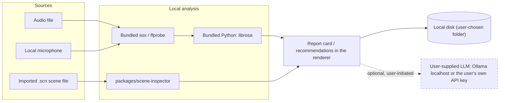
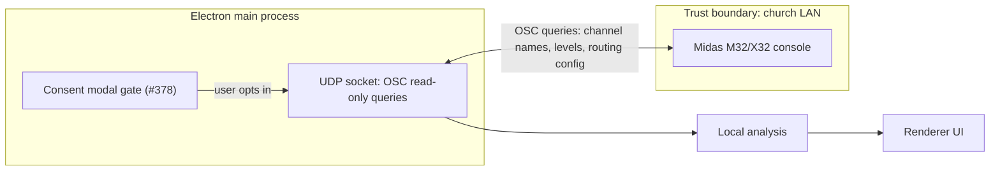

# Tier 1 / Tier 2 data-flow threat model

- **Issue:** [#379](https://github.com/on-par/sound-buddy/issues/379)
- **Source:** Council deliberation 2026-07-14 (Security Engineer proposal, 9/9)
- **Epic:** [#383](https://github.com/on-par/sound-buddy/issues/383)
- **Date:** 2026-07-18
- **Status:** Draft — pending review/approval
- **Related:** [#371](https://github.com/on-par/sound-buddy/issues/371) (OSC feasibility
  spike — blocked on this doc), [#378](https://github.com/on-par/sound-buddy/issues/378)
  (consent modal), [#383](https://github.com/on-par/sound-buddy/issues/383) (epic)

The council mandated this document (9/9, 2026-07-14) before any Tier 2
(console-network) work begins, including the OSC feasibility spike #371. It classifies
all 22 features from the Drew Brashler + MxU research synthesis, provides data-flow
diagrams for each tier, an attack-surface analysis for Tier 2, and documented
mitigations.

---

## Tier definitions

- **Tier 1 (local-only):** the feature consumes only local inputs — audio files, the
  local microphone, or imported `.scn` scene files (parsed by
  `packages/scene-inspector`) — and produces only local outputs. No sockets opened, no
  packets sent. Ships freely.
- **Tier 2 (console-network):** the feature opens an OSC-over-UDP session to a Midas
  M32/X32 console on the church LAN. New attack surface. Must not ship before the #378
  consent modal and this doc's mitigations exist. Read-only OSC only; anything requiring
  **write** access to the console (e.g. one-knob novice mode applying settings) is out
  of scope for v1 entirely, not merely Tier 2.

**Key boundary nuance:** importing a `.scn` **file** is Tier 1 (file parsing, no
network); reading the same data **live over OSC** is Tier 2. Several features therefore
have a Tier 1 as-scoped form and a Tier 2 "live" variant — see the Notes column below.

---

## Existing network surfaces (outside the tier model)

"Fully local" in this document, and elsewhere in Sound Buddy's messaging, refers
specifically to **audio and console data**. The app already has pre-existing,
disclosed control-plane network touchpoints, none of which carry audio or console
data:

1. **License activation/validation** against the Cloudflare worker (Stripe-backed).
2. **The check-only updater** hitting GitHub releases.
3. **The user-supplied AI narrative endpoint** — local Ollama or the user's own API
   key. The app never proxies AI requests (see CLAUDE.md design decision).

The license/Stripe code path stays fully decoupled from any console-networking code
(#378 requirement) — see [Mitigations](#mitigations).

---

## Feature classification

Frozen classification from the council transcript, #371, #378, #383, and the
synthesis groups A–E. Group legend: A = EQ Curve Targets & Harshness Detection
(#1–4), B = Compression/Dynamics (#5–10), C = Routing & Gain-Structure Diagnostics
(#11–14), D = Troubleshooting Wizards (#15–17), E = Workflow/UX (#18–22).

| # | Feature | Group | Tier | v1 status | Notes / Tier 2 variant |
|---|---------|-------|------|-----------|-------|
| 1 | Acoustic Guitar EQ Recipe | A | Tier 1 | → blog (#380) | static content |
| 2 | Harshness Rules Engine | A | Tier 1 | post-launch (#381) | file-analysis form; live-console-spectrum variant is Tier 2 |
| 3 | Dynamic EQ Advisor | A | Tier 2 | killed (wontfix-v1) | needs live console telemetry |
| 4 | De-Esser Starting Points | A | Tier 1 | → blog (#380) | static content |
| 5 | Vocal Compressor Starting Preset | B | Tier 1 | → blog (#380) | static content |
| 6 | Genre-Realistic Comp Path | B | Tier 1 | killed | advisory content, no console |
| 7 | Acoustic Guitar Comp Recipe | B | Tier 1 | → blog (#380) | static content |
| 8 | Series Compression Chain Advisor | B | Tier 1 | killed | via imported .scn; live variant Tier 2 |
| 9 | Gate Attack Warning | B | Tier 1 | killed | recording analysis |
| 10 | One-Knob Novice Mode | B | Tier 2 | killed | would need console **write** — excluded from v1 scope entirely |
| 11 | Bus Tap Point Advisor | C | Tier 1 | killed | via imported .scn (scene-inspector); live variant Tier 2 |
| 12 | Gain Structure Checker | C | Tier 1 | shipped as post-service report (#368) | full live version is Tier 2 (#371) |
| 13 | Input Block Conflict Checker | C | Tier 2 | killed | live console config required (#371) |
| 14 | Multi-Console Gain Ownership Flag | C | Tier 2 | killed | multi-console live state (#371) |
| 15 | Feedback Ring-Out Assistant | D | Tier 1 | mvp-in P0 (#366) | local mic/RTA FFT — explicitly NOT console API |
| 16 | Doubling/Phase Bug Detector | D | Tier 1 | mvp-in as guided checklist (#370) | "with live routing" variant is Tier 2 (#371) |
| 17 | Level-Mismatch Clip Diagnostic | D | Tier 1 | killed | recording analysis |
| 18 | Channel Build-Order Guide | E | Tier 1 | mvp-in (#367) | UI content |
| 19 | Rough-Pass / Contextual-Pass Mode | E | Tier 1 | mvp-in (#365) | UI mode |
| 20 | Skill-Tree Onboarding | E | Tier 1 | thin slice #374; full deferred (#382) | content/progression |
| 21 | Reverb/Delay Send Correctness Check | E | Tier 1 | killed | via imported .scn; live variant Tier 2 |
| 22 | DCA/Mute-Group Template | E | Tier 1 | killed | as template/content; applying live to console = write = out of scope |

---

## Tier 1 data flow

No network boundary is crossed by audio or console data in Tier 1. The only
optional, dashed edge — report summary to a user-supplied LLM — is user-initiated,
disclosed, and never proxied through Sound Buddy's own infrastructure.

---

## Tier 2 data flow

The consent modal (#378) gates every Tier 2 code path before the socket ever opens.
The OSC session is read-only and stays inside the church LAN trust boundary drawn
above — there is no cloud relay, and console data never leaves the LAN session.

---

## Tier 2 attack surface

1. **Unauthenticated, unencrypted protocol.** X32/M32 OSC has no authentication or
   transport security; any device on the LAN can read or spoof traffic.
2. **UDP spoofing / malicious responder.** Forged source addresses; a hostile device
   impersonating the console and feeding crafted responses.
3. **Untrusted input into the app.** The OSC parser processes attacker-controllable
   packets; malformed or oversized packets target parser bugs in the Electron main
   process.
4. **User-supplied console address.** Connect-to-arbitrary-IP risk — the app could be
   coerced into sending OSC traffic to hosts outside the LAN.
5. **Console availability.** App-side bugs or retry storms could flood the console
   mid-service (church WiFi instability is a known concern from #371).
6. **Discovery behavior.** Subnet scanning for consoles resembles hostile behavior on
   shared networks; discovery must be bounded and user-initiated.
7. **Brand/privacy risk.** Console access makes "fully local" *conditionally* true;
   nondisclosure of that fact is itself a threat — this is the council's core "why"
   for requiring this document before Tier 2 work starts.

---

## Mitigations

1. **First-run consent modal (#378).** Unmistakable opt-in, revocable in Settings,
   names exactly what is read. Gates every Tier 2 code path before any socket opens.
   Addresses: brand/privacy risk (7).
2. **Read-only OSC enforced in code.** Allowlist of query address patterns; no
   write/set commands exist anywhere in the codebase (#378 "read-only scope enforced
   in code"). Addresses: unauthenticated/unencrypted protocol (1), untrusted input (3).
3. **Local-subnet-only enforcement.** Console IP must be RFC 1918 and on-link;
   public/off-subnet addresses are refused with an actionable error. Addresses:
   user-supplied console address (4).
4. **No cloud relay, ever.** No raw console data is persisted or transmitted beyond
   the LAN session. Addresses: brand/privacy risk (7).
5. **Defensive OSC parsing.** Bounded packet size, strict type/length validation; the
   parser is treated as an untrusted-input surface and unit-tested against malformed
   packets. Addresses: UDP spoofing/malicious responder (2), untrusted input (3).
6. **Rate limiting + bounded exponential backoff on queries.** Offline/degraded mode
   is specified for every Tier 2 feature (#371 requirement). Addresses: console
   availability (5).
7. **Bounded, user-initiated console discovery.** No background subnet sweeps.
   Addresses: discovery behavior (6).
8. **Decoupled licensing.** The licensing/Stripe code path is fully decoupled from
   console-networking modules (#378). Addresses: brand/privacy risk (7), and limits
   blast radius if console-networking code is ever compromised.
9. **Off by default.** Tier 2 features are off by default; Tier 1 builds contain no
   reachable console-network code paths. Addresses: all surfaces above by default-deny.

---

## Review & sign-off

Acceptance criteria from #379:

- [x] All 22 features from the research synthesis are classified as Tier 1 or Tier 2.
- [x] Tier 1 and Tier 2 data-flow diagrams exist.
- [x] Tier 2 attack surface is analyzed.
- [x] Mitigations are documented and mapped to the surfaces they address.
- [ ] **Reviewed and approved before Tier 2 development begins.** — left unchecked;
  a human (Patrick / council) must check this box. Until it is checked, no Tier 2
  build work and no #371 spike work may start.
